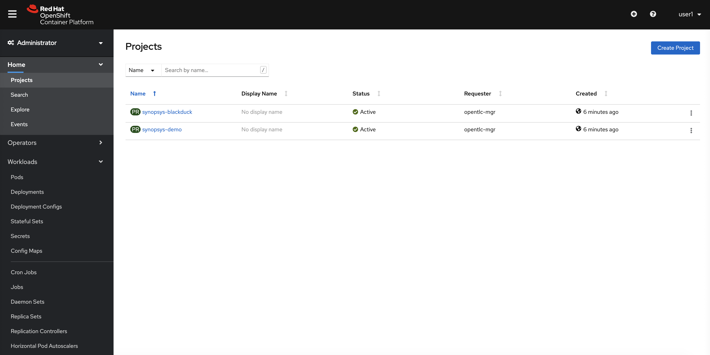
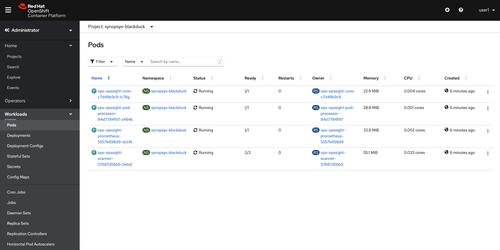
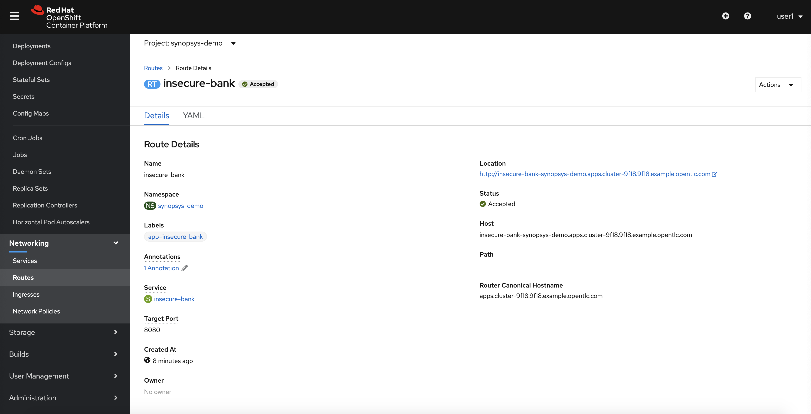
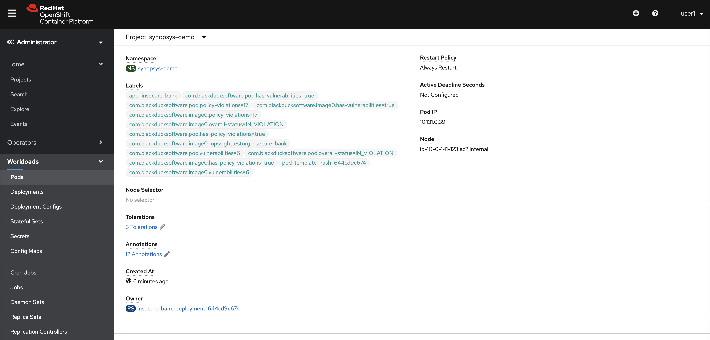
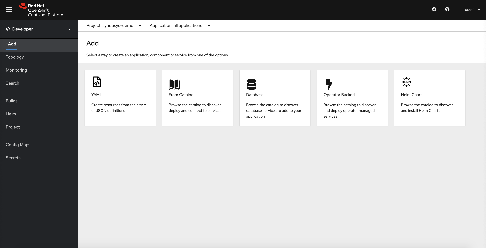
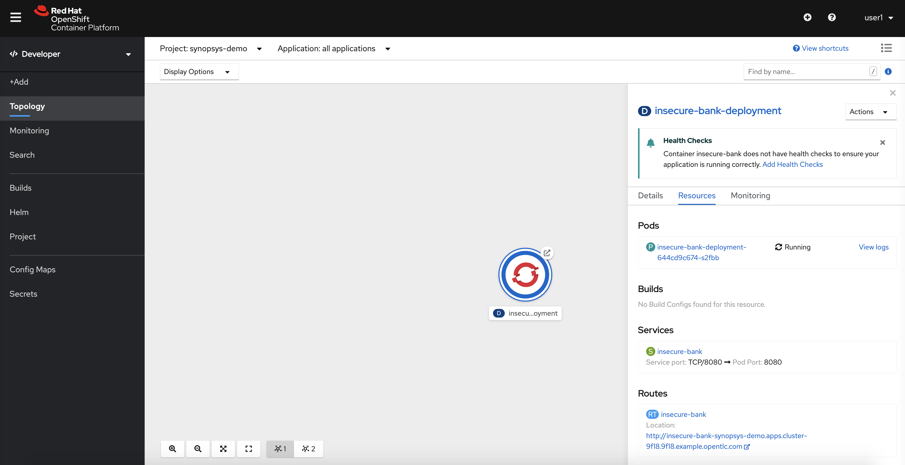

This workshop showcases scanning containers deployed on Red Hat OpenShift with Synopsys Black Duck Software Composition Analysis (SCA) in production workloads. Black Duck provides a solution for managing security, quality, and license compliance risk that comes from the use of open source and third-party code in applications and containers.

This workshop provides a fully deployed and running Black Duck integration and will cover the following topics:

1. How Black Duck for OpenShift is deployed and setup.
2. An overview of the demo Insecure Bank application.
3. How Black Duck Scanning works.
4. An overview of Black Duck Scanning results.
5. Scanning a custom container.

# Cluster & Project setup

A lab instructor is required to run this as a workshop. After the instructor deploys the RHPDS instance, it will create a Red Hat OpenShift cluster with two projects created, and Synopsys Black Duck for OpenShift deployed. The lab instructor will provide participants access to the cluster.



# Project & running pod verification

The two created projects are as follows - synopsys-blackduck & synopsys-demo. The synopsys-blackduck project contains 4 pods:

1. opssight-core: brains of the operation, a pod which communicates with Black Duck instance hosted at <https://redhathub.blackducksoftware.com/>, it maintains a list of all the scanned images and communicates with the rest of the pods.

2. opssight-pod-processor: a pod which connects with the pods and gets the underlying base image that's running inside the containers in OpenShift.

3. opssight-scanner: a pod which downloads the image from whichever image registry it's supposed to.

4. opssight-prometheus: a pod which monitors opssight's consumption of resources.



This also includes a configmap for configuring a lot of options e.g. when to look for scans to run, only run scans for specific project etc. There are 2 also 2 opaque secrets created which helps the integration with if any images that maybe coming from a private registry and which Black Duck instance to connect to. All of these options are preconfigured so workshop users need not worry about them.

The second project (synopsys-demo) is created to showcase a demo application and it should contain one pod. To access this application please see the routes created for the synopsys-demo project. Please visit the external URL though the created route to make sure it's up and running. The username and password should be "john@example.com" and "test" respectively.

# Demo Application details

The demo application is an insecure bank application where after logging in users can make dummy transactions. The underlying image that's running this application is located at <https://quay.io/repository/opssighttestorg/insecure-bank>. This underlying image running in OpenShift will be the one to be scanned.



# How the scanning works

For purposes of this workshop, the Black Duck scanner is configured to scan anything deployed in the synopsys-demo workspace. As soon as the insecure-bank application pod starts running the pod-processor is informed of that activity and the underlying image information is sent to the core peice which intiates the scaning process. The core pod sends the information to scanner pod which has 2 containers, the first one to download and temporarily store the image in memory and the other one to invoke the Black Duck scanner which creates the project (if not present) and scan. After the scanning is finished and Black Duck populates the Bill Of Materials (BOM) in Black Duck, the core pod retrieves the information and sends it to the pod processor to annotate the pods with policy violation and vulnerability count. To view these labels simply view the pods in the OpenShift UI and it should look something like "com.blackducksoftware.pod.overall-status=NOT_IN_VIOLATION".

[More details here](https://synopsys.atlassian.net/wiki/spaces/BDLM/pages/34275718/OpsSight+Architecture)



# Advanced setup (Scan a custom app)

> :warning: **PLEASE DON'T SCAN HUGE PROJECTS, THIS BLACK DUCK INSTANCE IS UNDER AN NFR LICENSE AND HAS LIMITED CAPACITY**

The objective is to deploy an application in the synopsys-demo project so that the Black Duck connector can scan it. In the steps below we'll be using the <https://quay.io/repository/opssighttestorg/ducky-crm> image.

1. Go to Developer section (persepective) instead of Administrator view in synopsys-demo project and select the YAML option.



2. Note: Other users may be creating the same application in this project, so it is important to modify the YAML below to use your lab username where [userx] is found. After updating the YAML, paste it into the editor text area and click Create to create the Deployment.

``` Yaml
apiVersion: apps/v1
kind: Deployment
metadata:
  name: [userx]-ducky-crm-deployment
  labels:
    app: ducky-crm
spec:
  replicas: 1
  selector:
    matchLabels:
      app: ducky-crm
  template:
    metadata:
      labels:
        app: ducky-crm
    spec:
      containers:
      - name: ducky-crm
        image: quay.io/opssighttestorg/ducky-crm:latest
        ports:
        - containerPort: 80
        resources:
          requests:
            memory: "256Mi"
            cpu: "500m"
          limits:
            memory: "512Mi"
            cpu: "1000m"
```
3. Click Add again and choose the YAML option to create the Service.  Remember to modify the YAML below first with your username.
``` Yaml
apiVersion: v1
kind: Service
metadata:
  name: [userx]-ducky-crm
  labels:
    app: ducky-crm
spec:
  selector:
    app: [userx]-ducky-crm
  ports:
    - protocol: TCP
      port: 8080
      targetPort: 8080
```

4. Verify it was successful in topology section (blue circle signifies app is running) by clicking on the new app in topology section -> go to resources tab -> and click on pods. The new labels should be shown there shortly (sometimes it takes some time).



5. You might not be able to see the scan due to workshop blackduck restrictions, if you want to see the scan results in Black Duck please contact your lab instructor and they can give you access in BD for your specific project.
